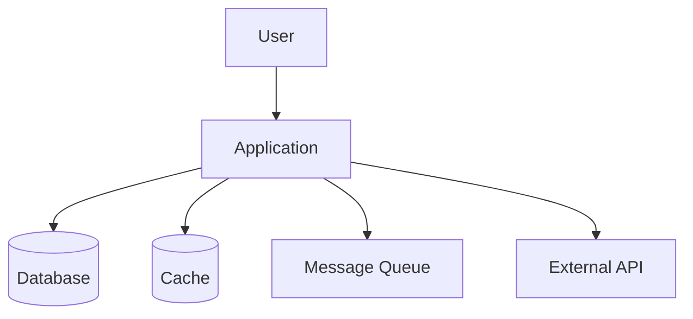

# Layer 4 — Design System

## Overview

Layer ini mencakup 4 area design:
1. System Design
2. Technical Design
3. UI/UX Design
4. Security Design

---

## 1. System Design

### Output
```
docs/design/system/
├── high-level-architecture.md
├── c4-model.md
├── sequence-diagram.md
├── state-diagram.md
├── event-flow.md
└── deployment.md
```

### Isi
- High-level architecture
- Service interaction
- Module interaction
- Event flow
- Retry flow
- Offline sync flow
- Deployment architecture

### Template: high-level-architecture.md

```markdown
# High-Level Architecture

## Architecture Style
[Monolith / Microservices / Modular Monolith / Serverless]

## System Context (C4 Level 1)



## Container Diagram (C4 Level 2)

| Container | Technology | Purpose |
|-----------|-----------|---------|
| Frontend | React/Next.js | User interface |
| API Gateway | Nginx/Kong | Request routing |
| Backend API | Node.js/Go | Business logic |
| Database | PostgreSQL | Data persistence |
| Cache | Redis | Session & caching |
| Queue | RabbitMQ/Kafka | Async processing |

## Communication Patterns
- Synchronous: REST/gRPC
- Asynchronous: Event-driven via message queue
- Real-time: WebSocket

## Deployment Architecture
- Environment: [Cloud provider]
- Container orchestration: [Kubernetes/Docker Compose]
- CI/CD: GitLab CI/CD
```

### Template: deployment.md

```markdown
# Deployment Architecture

## Environments
| Environment | Purpose | URL | Branch |
|-------------|---------|-----|--------|
| Development | Dev testing | dev.app.com | develop |
| Staging | QA & UAT | staging.app.com | release/* |
| Production | Live | app.com | main |

## Infrastructure
- Cloud: [AWS/GCP/Azure]
- Container: Docker
- Orchestration: Kubernetes
- Registry: GitLab Container Registry
- CDN: [Cloudflare/CloudFront]

## Scaling Strategy
- Horizontal: Auto-scaling based on CPU/memory
- Vertical: Database scaling
- Caching: Redis for hot data
```

---

## 2. Technical Design

### Output
```
docs/design/technical/
├── clean-architecture.md
├── folder-structure.md
├── naming-convention.md
├── testing-pattern.md
└── error-handling.md
```

### Template: clean-architecture.md

```markdown
# Clean Architecture

## Layer Structure

```
src/
├── domain/           # Enterprise Business Rules
│   ├── entities/     # Business entities
│   ├── value-objects/# Value objects
│   └── errors/      # Domain errors
├── application/      # Application Business Rules
│   ├── use-cases/   # Use case implementations
│   ├── ports/       # Interface definitions
│   └── dto/         # Data transfer objects
├── infrastructure/   # Frameworks & Drivers
│   ├── database/    # Database implementations
│   ├── http/        # HTTP clients
│   ├── queue/       # Message queue
│   └── cache/       # Cache implementations
└── presentation/     # Interface Adapters
    ├── controllers/ # Request handlers
    ├── middleware/  # Middleware
    └── validators/  # Input validation
```

## Dependency Rule
- Inner layers TIDAK BOLEH depend ke outer layers
- Domain layer TIDAK BOLEH import dari infrastructure
- Use case depend ke ports (interfaces), bukan implementations

## Dependency Injection
- Framework: [InversifyJS / tsyringe / manual]
- Registration: Centralized di composition root
```

### Template: error-handling.md

```markdown
# Error Handling Pattern

## Error Hierarchy
```
BaseError
├── DomainError
│   ├── ValidationError
│   ├── NotFoundError
│   └── BusinessRuleError
├── ApplicationError
│   ├── UnauthorizedError
│   ├── ForbiddenError
│   └── ConflictError
└── InfrastructureError
    ├── DatabaseError
    ├── NetworkError
    └── ExternalServiceError
```

## Error Response Format
```json
{
  "error": {
    "code": "VALIDATION_ERROR",
    "message": "Human readable message",
    "details": [
      {
        "field": "email",
        "message": "Invalid email format"
      }
    ],
    "requestId": "uuid",
    "timestamp": "ISO-8601"
  }
}
```

## Error Handling Rules
1. NEVER expose internal errors ke client
2. ALWAYS log full error stack internally
3. ALWAYS return consistent error format
4. Use error codes, bukan hanya messages
5. Include requestId untuk tracing
```

---

## 3. UI/UX Design

### Output
```
docs/design/ui-ux/
├── wireframe.md
├── component-library.md
├── accessibility.md
└── design-token.md
```

### Template: accessibility.md

```markdown
# Accessibility Standards

## WCAG 2.1 Level AA Compliance

### Perceivable
- [ ] All images have alt text
- [ ] Color contrast ratio >= 4.5:1
- [ ] Text resizable to 200%
- [ ] Captions for video content

### Operable
- [ ] All functionality via keyboard
- [ ] No keyboard traps
- [ ] Skip navigation links
- [ ] Focus indicators visible

### Understandable
- [ ] Language declared in HTML
- [ ] Consistent navigation
- [ ] Error identification and suggestion
- [ ] Labels for form inputs

### Robust
- [ ] Valid HTML
- [ ] ARIA landmarks
- [ ] Compatible with screen readers

## States yang Harus Di-handle
- Loading state
- Empty state
- Error state
- Offline state
- Skeleton loading
- Disabled state
```

---

## 4. Security Design

### Output
```
docs/design/security/
├── threat-model.md
├── trust-boundary.md
├── attack-surface.md
└── mitigation-plan.md
```

### Template: threat-model.md

```markdown
# Threat Model

## STRIDE Analysis

| Threat | Category | Asset | Likelihood | Impact | Risk |
|--------|----------|-------|------------|--------|------|
| [Threat] | Spoofing | Auth | High | High | Critical |
| [Threat] | Tampering | Data | Medium | High | High |
| [Threat] | Repudiation | Logs | Low | Medium | Low |
| [Threat] | Info Disclosure | PII | High | High | Critical |
| [Threat] | DoS | API | Medium | High | High |
| [Threat] | Elevation | Admin | Low | Critical | High |

## Trust Boundaries
1. Client ↔ API Gateway (untrusted → trusted)
2. API Gateway ↔ Backend (trusted → trusted)
3. Backend ↔ Database (trusted → trusted)
4. Backend ↔ External API (trusted → untrusted)

## Mitigation Strategies
| Threat | Mitigation | Implementation |
|--------|-----------|----------------|
| SQL Injection | Parameterized queries | ORM / prepared statements |
| XSS | Input sanitization + CSP | DOMPurify + helmet |
| CSRF | CSRF tokens | csurf middleware |
| Auth bypass | JWT + refresh tokens | jsonwebtoken library |
```

---

## Workflow dengan Kiro

```
"Berdasarkan specs di docs/specs/srs/,
generate system design documents.
Include: high-level architecture, C4 model, sequence diagrams, deployment architecture.
Simpan di docs/design/system/"
```

## GitLab Integration

### Design Review sebagai MR

Setiap design document harus melalui MR review:

```yaml
design-review:
  stage: validate
  script:
    - echo "Design documents updated - review required"
  rules:
    - changes:
        - docs/design/**/*
  allow_failure: false
```

## Best Practices

1. **Design before code** - Jangan coding tanpa design yang jelas
2. **Keep it simple** - Mulai sederhana, evolve seiring kebutuhan
3. **Document decisions** - Gunakan ADR untuk keputusan arsitektur
4. **Review with team** - Design bukan one-person job
5. **Security by design** - Security bukan afterthought

---

## Appendix: Clean Architecture Reference (dari Project Standards)

### Dependency Rule (WAJIB)

Layer dalam TIDAK BOLEH bergantung ke layer luar:

```
app → presentation → core
             ↘
        infrastructure
```

### Struktur Layer

```
src/
├── core/                    # Business Logic (paling dalam)
│   ├── domains/
│   │   └── [domain]/
│   │       ├── entities/
│   │       ├── repositories/  # Interface ONLY
│   │       ├── usecases/
│   │       ├── errors/
│   │       └── mappers/
│   ├── protocols/
│   └── utils/
├── infrastructure/          # Implementation
│   ├── di/
│   ├── networking/
│   ├── repositories/
│   ├── storage/
│   ├── logging/
│   └── stateManagement/
├── presentation/            # UI
│   ├── features/
│   │   └── [featureName]/
│   │       ├── screens/
│   │       ├── components/
│   │       ├── viewModel/
│   │       └── validation/
│   ├── components/          # Atomic Design
│   │   ├── atoms/
│   │   ├── molecules/
│   │   └── organisms/
│   └── hooks/
└── app/                     # Routing Layer (thin wrapper)
```

### Aturan Dependency (STRICT)

| From | Boleh Akses |
|------|-------------|
| core | ❌ tidak boleh ke mana pun |
| infrastructure | core |
| presentation | core |
| app | presentation |

### Data Flow

```
UI (Screen) → ViewModel → UseCase → Repository (interface)
→ Repository Implementation → API/Storage → DomainResult<T> → UI
```

---

## Appendix: Error Handling Pattern (dari Error Handling Standards)

### Klasifikasi Error

| Type | Contoh |
|------|--------|
| Validation | field wajib kosong, format email salah |
| Business | saldo tidak cukup, status tidak sesuai |
| Authorization | role tidak cukup, akses resource milik user lain |
| Authentication | token expired, session tidak ada |
| Not Found | resource tidak ditemukan |
| Technical | API timeout, network error, upstream 5xx |
| Unexpected | null access, invariant broken |

### Standard Error Model

```typescript
export interface AppError {
  type: 'validation' | 'business' | 'authentication' | 'authorization' | 'not_found' | 'technical' | 'unexpected';
  code: string;        // Stabil, untuk mapping/logging/testing
  message: string;     // Internal/dev context
  userMessage?: string; // Aman untuk user
  retryable?: boolean;
  cause?: unknown;     // Tidak boleh dibocorkan ke UI
}
```

### DomainResult Pattern (WAJIB)

- Repository → return `DomainResult<T>`
- Use case → unwrap/transform dengan aman
- ViewModel/UI → konsumsi hasil yang sudah dinormalisasi

### HTTP Status Mapping

| Status | Error Type |
|--------|-----------|
| 400 | Validation error |
| 401 | Authentication error |
| 403 | Authorization error |
| 404 | Not found |
| 409 | Business conflict |
| 422 | Domain validation |
| 429 | Rate limit |
| 500 | Unexpected/internal |
| 502/503/504 | Upstream/timeout |

### Error Code Convention

Gunakan code yang stabil dan eksplisit:
- `AUTH_TOKEN_EXPIRED`
- `PAYMENT_INSUFFICIENT_BALANCE`
- `PAYMENT_PARTNER_TIMEOUT`
- `COMMON_VALIDATION_FAILED`
- `COMMON_NOT_FOUND`

### Anti-Pattern Error Handling

❌ Menampilkan raw exception ke user
❌ Menangkap semua error lalu mengabaikannya
❌ Semua error dipaksa menjadi generic tanpa code
❌ Retry buta pada operasi non-idempotent
❌ Logging token/secret/payload sensitif saat error
❌ Melempar raw axios/fetch error ke ViewModel/UI

---

## Appendix: Security Design Reference (dari Security Standards)

### Prinsip Security

1. **Security by Default** - Fitur baru HARUS aman secara default
2. **Least Privilege** - Akses dibatasi seminimal mungkin
3. **Defense in Depth** - Keamanan berlapis
4. **Fail Securely** - Gagal dengan aman

### Authentication & Session Rules

- Gunakan **HttpOnly cookie** untuk token sensitif
- `Secure: true` di production
- `SameSite: Lax` atau `Strict`
- DILARANG menyimpan refresh token di localStorage
- Session validation final tetap di server/API

### XSS Protection

- Hindari `dangerouslySetInnerHTML` tanpa sanitasi
- Gunakan sanitization helper terpusat
- Validasi URL sebelum dipakai di `href`/redirect
- Tolak `javascript:` dan schema berbahaya

### CSRF Protection

- Gunakan `SameSite` cookie
- State-changing requests (POST/PUT/PATCH/DELETE) harus dilindungi

### Security Headers (WAJIB)

- `X-Content-Type-Options: nosniff`
- `Referrer-Policy`
- `X-Frame-Options` atau CSP `frame-ancestors`
- `Permissions-Policy`
- `Content-Security-Policy`

### Data Protection

- Kirim data ke client seminimal mungkin
- DILARANG log: token, password, OTP, CVV, PII sensitif
- Masking wajib: `0812****1234`, `ri***@domain.com`
