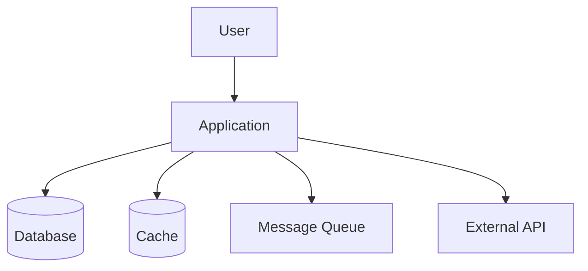

# Layer 4 — Design System

## Overview

Layer ini mencakup 4 area design:
1. System Design
2. Technical Design
3. UI/UX Design
4. Security Design

---

## 1. System Design

### Output
```
docs/design/system/
├── high-level-architecture.md
├── c4-model.md
├── sequence-diagram.md
├── state-diagram.md
├── event-flow.md
└── deployment.md
```

### Isi
- High-level architecture
- Service interaction
- Module interaction
- Event flow
- Retry flow
- Offline sync flow
- Deployment architecture

### Template: high-level-architecture.md

```markdown
# High-Level Architecture

## Architecture Style
[Monolith / Microservices / Modular Monolith / Serverless]

## System Context (C4 Level 1)



## Container Diagram (C4 Level 2)

| Container | Technology | Purpose |
|-----------|-----------|---------|
| Frontend | React/Next.js | User interface |
| API Gateway | Nginx/Kong | Request routing |
| Backend API | Node.js/Go | Business logic |
| Database | PostgreSQL | Data persistence |
| Cache | Redis | Session & caching |
| Queue | RabbitMQ/Kafka | Async processing |

## Communication Patterns
- Synchronous: REST/gRPC
- Asynchronous: Event-driven via message queue
- Real-time: WebSocket

## Deployment Architecture
- Environment: [Cloud provider]
- Container orchestration: [Kubernetes/Docker Compose]
- CI/CD: GitLab CI/CD
```

### Template: deployment.md

```markdown
# Deployment Architecture

## Environments
| Environment | Purpose | URL | Branch |
|-------------|---------|-----|--------|
| Development | Dev testing | dev.app.com | develop |
| Staging | QA & UAT | staging.app.com | release/* |
| Production | Live | app.com | main |

## Infrastructure
- Cloud: [AWS/GCP/Azure]
- Container: Docker
- Orchestration: Kubernetes
- Registry: GitLab Container Registry
- CDN: [Cloudflare/CloudFront]

## Scaling Strategy
- Horizontal: Auto-scaling based on CPU/memory
- Vertical: Database scaling
- Caching: Redis for hot data
```

---

## 2. Technical Design

### Output
```
docs/design/technical/
├── clean-architecture.md
├── folder-structure.md
├── naming-convention.md
├── testing-pattern.md
└── error-handling.md
```

### Template: clean-architecture.md

```markdown
# Clean Architecture

## Layer Structure

```
src/
├── domain/           # Enterprise Business Rules
│   ├── entities/     # Business entities
│   ├── value-objects/# Value objects
│   └── errors/      # Domain errors
├── application/      # Application Business Rules
│   ├── use-cases/   # Use case implementations
│   ├── ports/       # Interface definitions
│   └── dto/         # Data transfer objects
├── infrastructure/   # Frameworks & Drivers
│   ├── database/    # Database implementations
│   ├── http/        # HTTP clients
│   ├── queue/       # Message queue
│   └── cache/       # Cache implementations
└── presentation/     # Interface Adapters
    ├── controllers/ # Request handlers
    ├── middleware/  # Middleware
    └── validators/  # Input validation
```

## Dependency Rule
- Inner layers TIDAK BOLEH depend ke outer layers
- Domain layer TIDAK BOLEH import dari infrastructure
- Use case depend ke ports (interfaces), bukan implementations

## Dependency Injection
- Framework: [InversifyJS / tsyringe / manual]
- Registration: Centralized di composition root
```

### Template: error-handling.md

```markdown
# Error Handling Pattern

## Error Hierarchy
```
BaseError
├── DomainError
│   ├── ValidationError
│   ├── NotFoundError
│   └── BusinessRuleError
├── ApplicationError
│   ├── UnauthorizedError
│   ├── ForbiddenError
│   └── ConflictError
└── InfrastructureError
    ├── DatabaseError
    ├── NetworkError
    └── ExternalServiceError
```

## Error Response Format
```json
{
  "error": {
    "code": "VALIDATION_ERROR",
    "message": "Human readable message",
    "details": [
      {
        "field": "email",
        "message": "Invalid email format"
      }
    ],
    "requestId": "uuid",
    "timestamp": "ISO-8601"
  }
}
```

## Error Handling Rules
1. NEVER expose internal errors ke client
2. ALWAYS log full error stack internally
3. ALWAYS return consistent error format
4. Use error codes, bukan hanya messages
5. Include requestId untuk tracing
```

---

## 3. UI/UX Design

### Output
```
docs/design/ui-ux/
├── wireframe.md
├── component-library.md
├── accessibility.md
├── design-token.md
├── i18n-strategy.md
└── theming.md
```

### WAJIB: Atomic Design (Struktur Komponen)

Semua shared components **WAJIB** mengikuti Atomic Design methodology:

```
src/presentation/components/
├── atoms/              ← Elemen dasar (tidak bisa dipecah lagi)
│   ├── Button/
│   │   ├── Button.tsx
│   │   ├── Button.test.tsx
│   │   └── index.ts
│   ├── Input/
│   ├── Label/
│   ├── Icon/
│   ├── Badge/
│   └── Spinner/
│
├── molecules/          ← Kombinasi atoms (1 fungsi spesifik)
│   ├── FormField/     (Label + Input + Error message)
│   ├── SearchBar/     (Input + Button)
│   ├── NavItem/       (Icon + Label)
│   └── Card/          (Image + Title + Description)
│
├── organisms/          ← Komponen kompleks (section of page)
│   ├── Header/
│   ├── Sidebar/
│   ├── DataTable/
│   ├── LoginForm/
│   └── PaymentSummary/
│
└── templates/          ← Layout structure (opsional)
    ├── DashboardLayout/
    └── AuthLayout/
```

**Rules Atomic Design:**
1. **Atoms** — tidak boleh import molecule/organism. Hanya menerima props primitif.
2. **Molecules** — boleh import atoms. Satu fungsi spesifik.
3. **Organisms** — boleh import atoms + molecules. Bisa punya state lokal.
4. **Templates** — layout only, tidak ada business logic.
5. **Semua shared component** harus reusable dan tidak mengandung business logic.
6. **Feature-specific components** tetap di `src/presentation/features/[feature]/components/`.

### WAJIB: Internationalization (i18n)

Semua project yang punya UI **WAJIB** implement i18n dari awal — bukan ditambahkan belakangan.

#### Struktur i18n

```
src/presentation/locales/
├── id.json             ← Bahasa Indonesia (default)
├── en.json             ← English
└── index.ts            ← i18n configuration
```

#### Rules i18n

1. **DILARANG hardcode text** di component — semua text harus dari locale file
2. **Setiap string yang tampil ke user** harus melalui translation function
3. **Key naming convention**: `<feature>.<component>.<element>`
   ```json
   {
     "payment.form.title": "Pembayaran",
     "payment.form.amount_label": "Jumlah",
     "payment.form.submit_button": "Bayar Sekarang",
     "payment.error.insufficient_balance": "Saldo tidak cukup",
     "common.button.cancel": "Batal",
     "common.button.save": "Simpan"
   }
   ```
4. **Minimal 2 bahasa**: Bahasa Indonesia (id) + English (en)
5. **Gunakan library**: `next-intl` (Next.js) atau `react-i18next` (React)
6. **Pluralization dan formatting** harus di-handle (angka, tanggal, mata uang)
7. **Locale detection**: dari browser preference atau user setting

#### Template: `i18n-strategy.md`

```markdown
# Internationalization Strategy

## Supported Languages
| Code | Language | Status |
|------|----------|--------|
| id | Bahasa Indonesia | Default |
| en | English | Supported |

## Library
- [next-intl / react-i18next]

## Key Convention
- Format: `<feature>.<component>.<element>`
- Common keys: `common.button.*`, `common.error.*`, `common.label.*`

## Implementation
- All user-facing text via translation function
- No hardcoded strings in components
- Date/number formatting via locale-aware formatters
- RTL support: [yes/no]
```

### WAJIB: Dark & Light Theme

Semua project yang punya UI **WAJIB** support dark dan light theme dari awal.

#### Struktur Theming

```
src/presentation/
├── providers/
│   └── ThemeProvider.tsx       ← Theme context + toggle
├── styles/
│   ├── tokens/
│   │   ├── colors.ts          ← Color tokens (light + dark)
│   │   ├── spacing.ts         ← Spacing scale
│   │   ├── typography.ts      ← Font sizes, weights
│   │   └── index.ts
│   ├── themes/
│   │   ├── light.ts           ← Light theme values
│   │   ├── dark.ts            ← Dark theme values
│   │   └── index.ts
│   └── globals.css            ← CSS variables / Tailwind config
```

#### Rules Theming

1. **DILARANG hardcode warna** — semua warna harus dari design tokens/CSS variables
2. **Gunakan CSS variables** atau Tailwind `dark:` prefix untuk theming
3. **Theme detection**: dari system preference (`prefers-color-scheme`) + user toggle
4. **Persist preference**: simpan di localStorage
5. **Semua komponen** harus terlihat baik di light DAN dark mode
6. **Contrast ratio** tetap >= 4.5:1 di kedua theme (WCAG AA)
7. **Jangan gunakan** pure black (#000) untuk dark mode — gunakan dark gray (#1a1a2e atau similar)
8. **Images/icons** harus adaptif (atau punya variant untuk dark mode)

#### Design Tokens (Contoh)

```typescript
// src/presentation/styles/tokens/colors.ts
export const colors = {
  light: {
    background: '#ffffff',
    surface: '#f8f9fa',
    text: {
      primary: '#1a1a2e',
      secondary: '#6c757d',
      disabled: '#adb5bd',
    },
    border: '#dee2e6',
    primary: '#0066cc',
    error: '#dc3545',
    success: '#28a745',
  },
  dark: {
    background: '#1a1a2e',
    surface: '#16213e',
    text: {
      primary: '#e8e8e8',
      secondary: '#a0a0a0',
      disabled: '#6c757d',
    },
    border: '#2d2d44',
    primary: '#4da6ff',
    error: '#ff6b6b',
    success: '#51cf66',
  },
};
```

#### Template: `theming.md`

```markdown
# Theming Strategy

## Supported Themes
| Theme | Detection | Toggle |
|-------|-----------|--------|
| Light | Default / system preference | User toggle |
| Dark | System preference | User toggle |

## Implementation
- CSS Variables / Tailwind dark: prefix
- ThemeProvider context
- localStorage persistence
- System preference detection (prefers-color-scheme)

## Design Tokens
- Colors: light + dark variants
- Spacing: consistent scale
- Typography: responsive sizes
- Shadows: adapted per theme
- Border radius: consistent

## Rules
- No hardcoded colors in components
- All components must look good in both themes
- Contrast ratio >= 4.5:1 in both themes
- Images/icons must be theme-adaptive
```

### Template: accessibility.md

```markdown
# Accessibility Standards

## WCAG 2.1 Level AA Compliance

### Perceivable
- [ ] All images have alt text
- [ ] Color contrast ratio >= 4.5:1 (both themes)
- [ ] Text resizable to 200%
- [ ] Captions for video content

### Operable
- [ ] All functionality via keyboard
- [ ] No keyboard traps
- [ ] Skip navigation links
- [ ] Focus indicators visible (both themes)

### Understandable
- [ ] Language declared in HTML
- [ ] Consistent navigation
- [ ] Error identification and suggestion
- [ ] Labels for form inputs
- [ ] All text via i18n (no hardcoded strings)

### Robust
- [ ] Valid HTML
- [ ] ARIA landmarks
- [ ] Compatible with screen readers
- [ ] Theme toggle accessible via keyboard

## States yang Harus Di-handle
- Loading state (skeleton)
- Empty state
- Error state
- Offline state
- Skeleton loading
- Disabled state
- Dark/Light variants untuk semua state
```

### AI Agent Rules untuk UI/UX

1. **Atomic Design WAJIB** — setiap shared component harus di-categorize (atom/molecule/organism)
2. **i18n WAJIB dari awal** — DILARANG hardcode text, semua via translation function
3. **Dark + Light theme WAJIB** — DILARANG hardcode warna, semua via design tokens
4. **Accessibility WAJIB** — WCAG 2.1 AA compliance
5. **Saat membuat component baru** → tentukan level Atomic Design + pastikan i18n + pastikan theme-aware
6. **Saat review UI code** → cek: ada hardcoded text? ada hardcoded color? ada accessibility issue?

---

## 4. Security Design

### Output
```
docs/design/security/
├── threat-model.md
├── trust-boundary.md
├── attack-surface.md
└── mitigation-plan.md
```

### Template: threat-model.md

```markdown
# Threat Model

## STRIDE Analysis

| Threat | Category | Asset | Likelihood | Impact | Risk |
|--------|----------|-------|------------|--------|------|
| [Threat] | Spoofing | Auth | High | High | Critical |
| [Threat] | Tampering | Data | Medium | High | High |
| [Threat] | Repudiation | Logs | Low | Medium | Low |
| [Threat] | Info Disclosure | PII | High | High | Critical |
| [Threat] | DoS | API | Medium | High | High |
| [Threat] | Elevation | Admin | Low | Critical | High |

## Trust Boundaries
1. Client ↔ API Gateway (untrusted → trusted)
2. API Gateway ↔ Backend (trusted → trusted)
3. Backend ↔ Database (trusted → trusted)
4. Backend ↔ External API (trusted → untrusted)

## Mitigation Strategies
| Threat | Mitigation | Implementation |
|--------|-----------|----------------|
| SQL Injection | Parameterized queries | ORM / prepared statements |
| XSS | Input sanitization + CSP | DOMPurify + helmet |
| CSRF | CSRF tokens | csurf middleware |
| Auth bypass | JWT + refresh tokens | jsonwebtoken library |
```

---

## Workflow dengan Kiro

```
"Berdasarkan specs di docs/specs/srs/,
generate system design documents.
Include: high-level architecture, C4 model, sequence diagrams, deployment architecture.
Simpan di docs/design/system/"
```

## GitLab Integration

### Design Review sebagai MR

Setiap design document harus melalui MR review:

```yaml
design-review:
  stage: validate
  script:
    - echo "Design documents updated - review required"
  rules:
    - changes:
        - docs/design/**/*
  allow_failure: false
```

## Best Practices

1. **Design before code** - Jangan coding tanpa design yang jelas
2. **Keep it simple** - Mulai sederhana, evolve seiring kebutuhan
3. **Document decisions** - Gunakan ADR untuk keputusan arsitektur
4. **Review with team** - Design bukan one-person job
5. **Security by design** - Security bukan afterthought

---

## Appendix: Clean Architecture & DI Pattern

> **Standar lengkap Clean Architecture + Dependency Injection (Awilix)** ada di `architecture-standards.md`.
>
> File tersebut mencakup: layer structure, dependency rule, data flow, DI registration pattern, factory function pattern, lifetime rules, naming convention, anti-pattern, dan workflow membuat fitur baru.
>
> **WAJIB dibaca dan diikuti oleh semua AI Agent dan Developer.**

Quick reference:

```
app → presentation → core
             ↘
        infrastructure
```

| From | Boleh Akses |
|------|-------------|
| core | ❌ tidak boleh ke mana pun |
| infrastructure | core |
| presentation | core |
| app | presentation |

---

## Appendix: Error Handling Pattern (dari Error Handling Standards)

### Klasifikasi Error

| Type | Contoh |
|------|--------|
| Validation | field wajib kosong, format email salah |
| Business | saldo tidak cukup, status tidak sesuai |
| Authorization | role tidak cukup, akses resource milik user lain |
| Authentication | token expired, session tidak ada |
| Not Found | resource tidak ditemukan |
| Technical | API timeout, network error, upstream 5xx |
| Unexpected | null access, invariant broken |

### Standard Error Model

```typescript
export interface AppError {
  type: 'validation' | 'business' | 'authentication' | 'authorization' | 'not_found' | 'technical' | 'unexpected';
  code: string;        // Stabil, untuk mapping/logging/testing
  message: string;     // Internal/dev context
  userMessage?: string; // Aman untuk user
  retryable?: boolean;
  cause?: unknown;     // Tidak boleh dibocorkan ke UI
}
```

### DomainResult Pattern (WAJIB)

- Repository → return `DomainResult<T>`
- Use case → unwrap/transform dengan aman
- ViewModel/UI → konsumsi hasil yang sudah dinormalisasi

### HTTP Status Mapping

| Status | Error Type |
|--------|-----------|
| 400 | Validation error |
| 401 | Authentication error |
| 403 | Authorization error |
| 404 | Not found |
| 409 | Business conflict |
| 422 | Domain validation |
| 429 | Rate limit |
| 500 | Unexpected/internal |
| 502/503/504 | Upstream/timeout |

### Error Code Convention

Gunakan code yang stabil dan eksplisit:
- `AUTH_TOKEN_EXPIRED`
- `PAYMENT_INSUFFICIENT_BALANCE`
- `PAYMENT_PARTNER_TIMEOUT`
- `COMMON_VALIDATION_FAILED`
- `COMMON_NOT_FOUND`

### Anti-Pattern Error Handling

❌ Menampilkan raw exception ke user
❌ Menangkap semua error lalu mengabaikannya
❌ Semua error dipaksa menjadi generic tanpa code
❌ Retry buta pada operasi non-idempotent
❌ Logging token/secret/payload sensitif saat error
❌ Melempar raw axios/fetch error ke ViewModel/UI

---

## Appendix: Security Design Reference (dari Security Standards)

### Prinsip Security

1. **Security by Default** - Fitur baru HARUS aman secara default
2. **Least Privilege** - Akses dibatasi seminimal mungkin
3. **Defense in Depth** - Keamanan berlapis
4. **Fail Securely** - Gagal dengan aman

### Authentication & Session Rules

- Gunakan **HttpOnly cookie** untuk token sensitif
- `Secure: true` di production
- `SameSite: Lax` atau `Strict`
- DILARANG menyimpan refresh token di localStorage
- Session validation final tetap di server/API

### XSS Protection

- Hindari `dangerouslySetInnerHTML` tanpa sanitasi
- Gunakan sanitization helper terpusat
- Validasi URL sebelum dipakai di `href`/redirect
- Tolak `javascript:` dan schema berbahaya

### CSRF Protection

- Gunakan `SameSite` cookie
- State-changing requests (POST/PUT/PATCH/DELETE) harus dilindungi

### Security Headers (WAJIB)

- `X-Content-Type-Options: nosniff`
- `Referrer-Policy`
- `X-Frame-Options` atau CSP `frame-ancestors`
- `Permissions-Policy`
- `Content-Security-Policy`

### Data Protection

- Kirim data ke client seminimal mungkin
- DILARANG log: token, password, OTP, CVV, PII sensitif
- Masking wajib: `0812****1234`, `ri***@domain.com`

---

## Appendix: NFC & Offline-First Security (dari Project Sovereign Card)

### Konteks

Untuk project berbasis NFC card dimana data tersimpan langsung di kartu fisik (bukan database pusat), security model berbeda dari web app tradisional. Seluruh data hidup di kartu — sehingga proteksi data pada kartu menjadi kritis.

### Trust Boundaries (NFC-Specific)

```
User (untrusted) ↔ NFC Card (physical, tamper-possible)
NFC Card ↔ Web NFC API (browser-mediated)
Web NFC API ↔ Application Logic (trusted)
Application Logic ↔ Local Storage (device-bound)
```

### Threat Model (NFC Card System)

| Threat | Category | Asset | Likelihood | Impact | Mitigation |
|--------|----------|-------|------------|--------|------------|
| Card cloning | Tampering | Balance data | Medium | High | HMAC integrity check |
| Balance manipulation | Tampering | Saldo | High | Critical | HMAC-SHA256 signature |
| Card data sniffing | Info Disclosure | PII | Low | Medium | XOR obfuscation + binary format |
| Replay attack | Spoofing | Transaction | Medium | High | writeVersion increment |
| Unauthorized admin access | Elevation | Admin functions | Medium | High | PIN + PBKDF2 hashing |
| Card removal during write | DoS | Data integrity | High | Medium | Read-back verification |
| Offline data tampering | Tampering | Audit trail | Low | Medium | IndexedDB + fire-and-forget audit |

### Data Protection pada NFC Card

#### Silent Shield Pattern

Data kartu dilindungi dengan mekanisme berlapis:

```
Raw CardData
    ↓ serialize (binary compact format)
Binary Data (max 480 bytes)
    ↓ XOR encode (obfuscation)
Encoded Data
    ↓ HMAC-SHA256 sign (integrity)
[Encoded Data | HMAC 32 bytes]
    ↓ write to NFC card
NDEF Record (application/x-sovereign-card)
```

#### Read Flow (Verify)

```
NDEF Record
    ↓ extract bytes
[Encoded Data | HMAC 32 bytes]
    ↓ verify HMAC (integrity check)
    ↓ XOR decode (de-obfuscation)
Binary Data
    ↓ deserialize
CardData (domain entity)
```

#### Rules

- HMAC key TIDAK BOLEH dalam plain text di source code
- Gunakan obfuscated key (split constants, assembled at runtime)
- Setiap write HARUS increment `writeVersion` (anti-replay)
- Setiap write HARUS diikuti read-back verification
- Payload TIDAK BOLEH melebihi 480 bytes (NTAG215 limit)

### PIN & Operator Authentication

```
Algorithm: SHA-256 (PBKDF2)
Salt: 16 bytes random (crypto.getRandomValues)
Iterations: 100,000
Storage format: "salt_hex:hash_hex"
```

#### Rules

- PIN TIDAK PERNAH disimpan plain text
- PIN TIDAK PERNAH di-log
- Salt harus unique per operator
- Minimum 100,000 iterations untuk PBKDF2
- Gunakan Web Crypto API (bukan library JS murni)

### Write Operation Security

```
Write flow yang aman:
1. Serialize CardData → binary
2. Validate payload size (max 480 bytes)
3. Encode + Sign (Silent Shield)
4. Write to NFC card
5. Read-back verification (WAJIB)
6. Compare writeVersion (anti-corruption check)
7. Audit log (fire-and-forget)
```

#### Rules

- JANGAN lepaskan kartu selama write (abort = card removed error)
- Timeout 3 detik per operasi NFC
- Jika read-back verification gagal → return error, JANGAN anggap berhasil
- writeVersion mismatch = data corruption → return error

### Offline-First Security Considerations

| Concern | Mitigation |
|---------|-----------|
| No server validation | HMAC integrity pada kartu itu sendiri |
| No central audit | IndexedDB audit log di device |
| No real-time fraud detection | writeVersion untuk detect replay |
| Device compromise | PIN hashing, obfuscated keys |
| Data loss on device | Data hidup di kartu, bukan device |

### Local Storage Security

| Data | Storage | Protection |
|------|---------|-----------|
| Tariff config | localStorage | Plain (non-sensitive) |
| Operator PINs | localStorage | PBKDF2 hash + salt |
| Operator session | localStorage | Session-scoped, cleared on logout |
| Audit logs | IndexedDB | Device-bound, exportable |
| Card data | NFC card only | HMAC + XOR + binary serialization |

#### Rules

- DILARANG menyimpan card data di localStorage/IndexedDB
- Card data HANYA hidup di NFC card fisik
- Operator PIN HANYA disimpan sebagai hash
- Session harus di-clear saat logout
- Audit log tidak mengandung raw card data (hanya metadata operasi)

### NFC-Specific Error Handling

| Error | Code | Retryable | User Message |
|-------|------|-----------|-------------|
| NFC not supported | `NFC_NOT_SUPPORTED` | No | Perangkat tidak mendukung NFC |
| NFC disabled | `NFC_DISABLED` | Yes | NFC dinonaktifkan, aktifkan di pengaturan |
| Card timeout | `NFC_TIMEOUT` | Yes | Kartu tidak terdeteksi, tempelkan kembali |
| Read failed | `NFC_READ_FAILED` | Yes | Gagal membaca kartu |
| Write failed | `NFC_WRITE_FAILED` | Yes | Gagal menulis, jangan lepaskan kartu |
| Card removed | `NFC_CARD_REMOVED` | Yes | Kartu terlepas saat operasi |
| HMAC invalid | `SHIELD_HMAC_INVALID` | No | Data kartu tidak valid (mungkin rusak) |
| Card blocked | `CARD_BLOCKED` | No | Kartu diblokir, hubungi admin |

### Security Testing untuk NFC

WAJIB ada test untuk:

- HMAC verification menolak data yang dimanipulasi
- PIN hashing menghasilkan hash yang berbeda untuk PIN berbeda
- PIN hashing menghasilkan hash yang sama untuk PIN sama + salt sama
- writeVersion increment setiap write
- Read-back verification mendeteksi write failure
- Payload size validation menolak data > 480 bytes
- Kartu blocked ditolak di semua operasi
- Timeout handling tidak menyebabkan data corruption
- Audit log tidak mengandung sensitive data

### Production Upgrade Path

Untuk upgrade dari prototype ke production:

| Area | Prototype (Current) | Production (Target) |
|------|-------------------|-------------------|
| Encryption | XOR obfuscation | AES-256-GCM |
| Key management | Obfuscated in bundle | Backend signing / secure element |
| HMAC | Client-side key | Server-provisioned key per device |
| Audit | Local IndexedDB | Sync to central server (when online) |
| PIN | PBKDF2 client-side | Server-validated + device binding |
| Card provisioning | Manual by operator | Backend-issued card certificates |


---

## Workflow Integration — Design Validation dalam Development Flow

### Prinsip

Design bukan hanya dokumen awal yang dilupakan setelah coding dimulai. Design adalah **kontrak** yang harus divalidasi sepanjang development.

---

### 0. Mandatory Design Documents (WAJIB Generate Saat Layer 4 Dikerjakan)

Saat user meminta mengerjakan Layer 4 (Design System), AI Agent **WAJIB generate SEMUA dokumen berikut** secara lengkap. Ini bukan on-demand — ini adalah **full design package**.

#### Dokumen yang WAJIB Di-generate

```
docs/design/
├── system/
│   ├── high-level-architecture.md    ← WAJIB
│   ├── sequence-diagram.md           ← WAJIB
│   ├── deployment.md                 ← WAJIB
│   ├── c4-model.md                   ← WAJIB
│   └── event-flow.md                 ← Opsional (jika event-driven)
│
├── technical/
│   ├── clean-architecture.md         ← WAJIB
│   ├── folder-structure.md           ← WAJIB
│   ├── error-handling.md             ← WAJIB
│   ├── naming-convention.md          ← WAJIB
│   └── testing-pattern.md            ← WAJIB
│
├── security/
│   ├── threat-model.md               ← WAJIB
│   ├── trust-boundary.md             ← WAJIB
│   ├── attack-surface.md             ← Opsional
│   └── mitigation-plan.md            ← Opsional
│
└── ui-ux/
    ├── wireframe.md                  ← WAJIB (jika ada UI)
    ├── component-library.md          ← WAJIB (jika ada UI)
    ├── accessibility.md              ← WAJIB (jika ada UI)
    ├── i18n-strategy.md              ← WAJIB (jika ada UI)
    ├── theming.md                    ← WAJIB (jika ada UI)
    └── design-token.md               ← Opsional
```

#### Flow Generate Design Documents

```
[User: "Kerjakan Layer 4" atau "Buat design system"]
    ↓
[AI Agent baca context:]
    - docs/product/vision.md (Layer 0)
    - docs/specs/srs/*.md (Layer 3)
    - docs/requirements/extracted/*.md (Layer 1)
    ↓
[Generate SEMUA dokumen WAJIB secara sequential:]
    ↓
━━━ 🏗️ ARCHITECT AGENT ━━━
1. System Design:
   - high-level-architecture.md (C4 Level 1-2, tech stack, communication patterns)
   - sequence-diagram.md (flow utama: user → API → DB → response)
   - deployment.md (environments, infra, scaling strategy)
   - c4-model.md (context, container, component diagrams)
    ↓
2. Technical Design:
   - clean-architecture.md (layer structure, dependency rule — sesuai architecture-standards)
   - folder-structure.md (src/ tree lengkap sesuai project)
   - error-handling.md (error hierarchy, DomainResult pattern, HTTP mapping)
   - naming-convention.md (files, classes, functions, DI keys)
   - testing-pattern.md (test pyramid, per-layer strategy)
    ↓
━━━ 🔒 SECURITY AGENT ━━━
3. Security Design:
   - threat-model.md (STRIDE analysis, risk matrix)
   - trust-boundary.md (boundary diagram, data flow trust levels)
    ↓
━━━ 🎨 FRONTEND AGENT ━━━
4. UI/UX Design (jika project punya UI):
   - wireframe.md (screen list, user flow, layout)
   - component-library.md (Atomic Design: atoms, molecules, organisms)
   - accessibility.md (WCAG 2.1 AA + theme accessibility)
   - i18n-strategy.md (supported languages, key convention, library)
   - theming.md (dark/light tokens, detection, persistence)
    ↓
[Semua dokumen di-commit]
    ↓
[Update docs/CONTEXT-INDEX.md]
    ↓
[Informasikan user: "Layer 4 selesai. [N] design documents generated."]
    ↓
[Tanyakan konfirmasi sebelum lanjut ke layer berikutnya]
```

#### Konten Minimum per Dokumen

**`high-level-architecture.md`** harus berisi:
- Architecture style (monolith/microservices/modular monolith)
- System context diagram (C4 Level 1)
- Container diagram (C4 Level 2) — tech stack per container
- Communication patterns (sync/async/real-time)
- Data storage strategy

**`sequence-diagram.md`** harus berisi:
- Minimal 3 sequence diagrams untuk flow utama
- Format: Mermaid atau ASCII
- Cover: happy path + error path

**`deployment.md`** harus berisi:
- Environments (dev, staging, production)
- Infrastructure (cloud provider, container, orchestration)
- Scaling strategy (horizontal/vertical)
- CI/CD deployment flow

**`clean-architecture.md`** harus berisi:
- Layer diagram (core → infrastructure → presentation → app)
- Dependency rule
- Tanggung jawab per layer
- Referensi ke `architecture-standards.md` untuk detail

**`folder-structure.md`** harus berisi:
- Complete `src/` tree sesuai project
- Penjelasan setiap folder
- Naming convention per folder

**`error-handling.md`** harus berisi:
- Error hierarchy (DomainError, ApplicationError, InfrastructureError)
- DomainResult pattern
- HTTP status mapping
- Error code convention

**`threat-model.md`** harus berisi:
- STRIDE analysis table
- Trust boundaries diagram
- Risk matrix (probability × impact)
- Mitigation strategies per threat

**`wireframe.md`** harus berisi:
- Screen list (semua halaman)
- User flow diagram
- Layout per screen (ASCII wireframe atau deskripsi)

**`component-library.md`** harus berisi:
- Atomic Design breakdown (atoms, molecules, organisms)
- Component list per level
- Props/interface per component utama

**`accessibility.md`** harus berisi:
- WCAG 2.1 Level AA checklist
- States yang harus di-handle (loading, empty, error, offline, disabled)
- Keyboard navigation requirements
- Screen reader considerations
- Theme accessibility (contrast di kedua theme)

**`i18n-strategy.md`** harus berisi:
- Supported languages (minimal: id + en)
- Library yang digunakan (next-intl / react-i18next)
- Key naming convention (`<feature>.<component>.<element>`)
- Pluralization dan formatting strategy
- Locale detection method

**`theming.md`** harus berisi:
- Supported themes (light + dark)
- Design tokens (colors, spacing, typography per theme)
- Implementation approach (CSS variables / Tailwind dark:)
- Theme detection (system preference + user toggle)
- Persistence strategy (localStorage)

#### Rules

1. **WAJIB generate SEMUA dokumen WAJIB** saat Layer 4 dikerjakan — bukan sebagian
2. **Sesuaikan konten** dengan context project (tech stack, fitur, domain)
3. **Jika project backend-only** (tanpa UI) → skip `ui-ux/` folder, informasikan user
4. **Jika project tanpa auth/payment** → threat-model tetap WAJIB (minimal basic threats)
5. **Gunakan Mermaid** untuk diagrams jika memungkinkan
6. **Commit semua sekaligus** setelah generate
7. **Tanyakan konfirmasi user** setelah selesai sebelum lanjut ke layer berikutnya

---

### 1. Design Document Gate

```
[Fitur kompleks akan di-implement]
    ↓
[AI Agent cek: Apakah design document ada?]
    ↓
├── ADA → Validate code terhadap design
├── BELUM ADA + Fitur kompleks → Buat design dulu
└── BELUM ADA + Fitur sederhana → Skip, langsung code
```

**Kapan design document WAJIB:**
- Fitur yang melibatkan > 3 komponen/service
- Fitur yang mengubah data model existing
- Fitur yang melibatkan integrasi external service
- Fitur yang punya security implications
- Fitur yang mengubah arsitektur existing

**Kapan design document BOLEH di-skip:**
- CRUD sederhana yang mengikuti pattern existing
- UI component baru yang mengikuti design system
- Bug fix
- Refactoring

---

### 2. Kiro Hook: Design Compliance Check

```json
{
  "name": "Design Compliance Check",
  "version": "1.0.0",
  "description": "Validasi bahwa implementation sesuai dengan design document",
  "when": {
    "type": "postTaskExecution"
  },
  "then": {
    "type": "askAgent",
    "prompt": "Setelah task selesai, cek DESIGN COMPLIANCE:\n\n**1. Cek apakah ada design document untuk fitur ini:**\n- Lihat di docs/design/system/ atau docs/design/technical/\n- Jika ada → lanjut ke step 2\n- Jika tidak ada DAN fitur ini kompleks → informasikan user bahwa design document sebaiknya dibuat\n\n**2. Jika design document ada, validasi:**\n- Apakah data flow di code sesuai dengan sequence diagram di design?\n- Apakah komponen yang dibuat sesuai dengan component diagram?\n- Apakah API contract sesuai dengan yang didefinisikan di design?\n- Apakah error handling sesuai dengan failure scenario di design?\n- Apakah security measures sesuai dengan threat model?\n\n**3. Jika ada DEVIASI dari design:**\n- Informasikan user: 'Implementation berbeda dari design di [area]. Apakah ini intentional?'\n- Jika intentional → update design document agar tetap sinkron\n- Jika tidak intentional → fix implementation agar sesuai design\n\n**4. Jika tidak ada design document:**\n- Untuk fitur sederhana → skip\n- Untuk fitur kompleks → suggest: 'Fitur ini cukup kompleks. Mau saya buatkan design document untuk dokumentasi?'"
  }
}
```

---

### 3. Design Types dan Kapan Dibutuhkan

| Design Type | Kapan Dibutuhkan | Output |
|-------------|-----------------|--------|
| System Design | Fitur baru yang melibatkan multiple services | C4 diagram, sequence diagram |
| Technical Design | Fitur yang mengubah arsitektur/pattern | Component diagram, data flow |
| UI/UX Design | Fitur dengan user-facing interface baru | Wireframe, component hierarchy |
| Security Design | Fitur dengan auth/payment/sensitive data | Threat model, trust boundary |

### Minimum Design Document

Untuk fitur yang butuh design, minimal harus ada:

```markdown
# Design: [Feature Name]

## Overview
[1 paragraf: apa yang dibangun dan kenapa]

## Data Flow
[Diagram atau deskripsi: bagaimana data mengalir dari input ke output]

## Components
[List komponen yang terlibat dan tanggung jawab masing-masing]

## API Contract (jika ada)
[Endpoint, request/response format]

## Error Scenarios
[Apa yang bisa gagal dan bagaimana handling-nya]

## Security Considerations
[Jika ada data sensitif atau auth flow]
```

---

### 4. Design Review dalam AI Review (Layer 11)

AI Agent WAJIB mengecek design compliance saat melakukan code review:

```markdown
## Design Review Checklist (tambahan untuk Layer 11)

- [ ] Apakah implementation mengikuti data flow yang didefinisikan di design?
- [ ] Apakah semua komponen yang didefinisikan di design sudah diimplementasi?
- [ ] Apakah tidak ada komponen tambahan yang tidak ada di design (scope creep)?
- [ ] Apakah error handling sesuai dengan failure scenario di design?
- [ ] Apakah security measures sesuai dengan threat model?
- [ ] Jika ada deviasi → apakah design document sudah di-update?
```

---

### 5. Integration dengan Layer Lain

| Layer | Bagaimana Layer 4 Terintegrasi |
|-------|-------------------------------|
| Layer 3 (Spec-Driven) | Spec menjadi input untuk design |
| Layer 8 (Issue-Driven) | Issue yang kompleks HARUS punya design reference |
| Layer 11 (AI Review) | Review cek design compliance |
| Layer 13 (Observability) | Design harus include observability points |
| Layer 14 (Learning) | Design yang sering berubah = signal untuk improve spec |

---

### 6. AI Agent Rules

1. **Fitur kompleks WAJIB punya design** sebelum coding
2. **Design adalah living document** — update jika implementation berubah
3. **Deviasi dari design HARUS dikomunikasikan** ke user
4. **Design review masuk ke AI Review checklist** (Layer 11)
5. **JANGAN over-design** fitur sederhana — proportional effort
6. **Security design WAJIB** untuk fitur yang handle sensitive data
7. **Design document disimpan** di `docs/design/[type]/[feature-name].md`
