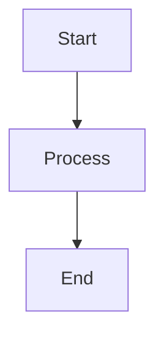

# Presentation Material Generation

## Overview

Steering file ini memandu AI Agent untuk membuat materi presentasi tentang project yang sedang dikerjakan. Materi presentasi mencakup 6 area utama software engineering yang relevan dengan framework ini.

## Kapan Digunakan

- Setelah project selesai atau mencapai milestone/sprint
- Saat perlu presentasi ke stakeholder/management
- Untuk dokumentasi akademik atau portfolio
- Saat onboarding tim baru

## Konten Presentasi

Materi presentasi terdiri dari 6 bagian utama:

1. **UI/UX Design**
2. **Software Design**
3. **Software Construction**
4. **Software Quality**
5. **Software Deployment**
6. **Software Security**

---

## 1. UI/UX Design

### Konten yang Harus Disertakan

```markdown
# UI/UX Design

## User Research
- Target users dan personas
- Pain points yang ditemukan
- User journey map

## Information Architecture
- Sitemap / navigation structure
- Content hierarchy
- User flow diagrams

## Wireframe dan Mockup
- Low-fidelity wireframes
- High-fidelity mockups
- Interactive prototype (jika ada)

## Design System
- Color palette dan typography
- Component library (Atomic Design: atoms, molecules, organisms)
- Design tokens
- Spacing dan grid system

## Responsive Design
- Breakpoints strategy
- Mobile-first approach
- Adaptive vs responsive decisions

## Accessibility
- WCAG compliance level
- Keyboard navigation
- Screen reader support
- Color contrast ratios

## User States
- Loading states (skeleton)
- Empty states
- Error states
- Success states
- Offline states
- Disabled states

## Usability Testing
- Testing methodology
- Key findings
- Iterations based on feedback
```

### Source dari Project

- `docs/design/ui-ux/wireframe.md`
- `docs/design/ui-ux/component-library.md`
- `docs/design/ui-ux/accessibility.md`
- `docs/design/ui-ux/design-token.md`

### Reference Steering

- `layer-4-design-system.md` → Section 3: UI/UX Design

---

## 2. Software Design

### Konten yang Harus Disertakan

```markdown
# Software Design

## Architecture Overview
- Architecture style: Clean Architecture + DDD
- High-level architecture diagram
- C4 Model (Context, Container, Component, Code)

## Layer Structure
- Core (Domain): entities, repositories (interface), use cases, domain errors
- Infrastructure: DI container (Awilix), networking, repository impl, storage
- Presentation: features, screens, viewModel, components (Atomic Design)
- App: Next.js App Router (routing layer, thin wrapper)

## Dependency Rule
- Inner layers TIDAK BOLEH depend ke outer layers
- Core → tidak boleh ke mana pun
- Infrastructure → core only
- Presentation → core only
- App → presentation only

## Data Flow
- UI → ViewModel → UseCase → Repository (interface) → Impl → API/Storage → DomainResult<T> → UI
- DTO → Domain Entity → View Model → UI

## Dependency Injection (Awilix)
- Composition root terpusat di infrastructure/di/
- Factory function pattern
- Singleton/Scoped/Transient lifetime
- Protocol-based abstraction

## API Design
- API contract overview
- Endpoint list
- Request/response format
- Error response format (AppError)

## Architecture Decision Records (ADR)
- Key decisions made
- Alternatives considered
- Trade-offs accepted
```

### Source dari Project

- `docs/design/system/high-level-architecture.md`
- `docs/design/system/sequence-diagram.md`
- `docs/design/technical/clean-architecture.md`
- `docs/specs/srs/architecture.md`
- `docs/adr/`

### Reference Steering

- `architecture-standards.md` → Full Clean Architecture + DI Pattern
- `layer-4-design-system.md` → Section 1-2: System & Technical Design

---

## 3. Software Construction

### Konten yang Harus Disertakan

```markdown
# Software Construction

## Technology Stack
- Frontend: Next.js (App Router), React, TypeScript
- State Management: Zustand
- DI Container: Awilix
- Styling: Tailwind CSS
- Testing: Vitest
- Linting: ESLint + Prettier

## Development Methodology
- AI-Native SDLC (Enterprise Framework)
- Spec-Driven Development
- Issue-Driven Development (1 issue = 1 bounded context)
- Multi-Agent Orchestration (BA, Architect, Security, Frontend, Backend, QA, DevOps)

## Code Architecture
- Clean Architecture + DDD implementation
- Layer separation: Core → Infrastructure → Presentation → App
- Dependency Injection via Awilix (factory function pattern)
- Repository pattern (interface di core, impl di infrastructure)

## Code Patterns
- Entity / Value Object pattern
- Use Case pattern (factory function, DI-friendly)
- DTO + Mapper pattern (DTO → Entity → ViewModel)
- ViewModel pattern (UI state orchestration)
- DomainResult<T> pattern (success/failure handling)
- AppError pattern (typed error with code, message, retryable)

## Development Workflow
- Branch strategy: main → develop → feature/issue-{N}-{desc}
- Commit convention: Conventional Commits (feat, fix, docs, test, refactor, chore)
- Auto-push after task completion (via Kiro hooks)
- MR creation after sprint completion
- Human approval before merge

## AI-Assisted Development
- AI Agent roles: BA, Architect, Security, Frontend, Backend, QA, DevOps
- AI Skills: create-api, create-usecase, create-repository, create-component, create-test
- AI Governance: validate before execute, specification first
- AI Review: architecture compliance, security, performance

## Configuration & CI-Readiness
- TypeScript strict mode
- ESLint config (.eslintrc.json / eslint.config.mjs) — WAJIB sebelum push
- Prettier config (.prettierrc)
- Path aliases (@/ → src/)
- Naming conventions (kebab-case files, PascalCase components)
- Vitest config (vitest.config.ts)
- Commitlint config (commitlint.config.js)
```

### Source dari Project

- `docs/design/technical/clean-architecture.md`
- `docs/design/technical/naming-convention.md`
- `docs/governance/coding-standards.md`
- `.kiro/skills/`
- `src/` (code patterns)
- `package.json` (tech stack)

### Reference Steering

- `architecture-standards.md` → Clean Architecture + DI Pattern lengkap
- `git-workflow-automation.md` → Commit convention, branch strategy, auto-push
- `project-structure.md` → Folder structure, CI-readiness configs
- `layer-8-issue-driven-dev.md` → Issue-driven development
- `layer-9-agent-orchestration.md` → Multi-agent workflow

---

## 4. Software Quality

### Konten yang Harus Disertakan

```markdown
# Software Quality

## Testing Strategy
- Test pyramid (Unit > Integration > E2E)
- Testing tools: Vitest, React Testing Library, Playwright
- Coverage targets: >= 80% (statements, branches, functions, lines)

## Unit Testing
- Use case tests (mock repository)
- Mapper tests (field mapping, fallback)
- Repository tests (mock HTTP, verify mapper call)
- ViewModel tests (state change, success/error path)
- Helper/utility tests

## Integration Testing
- API endpoint tests
- Database integration tests
- External service mock tests

## End-to-End Testing
- Critical user flow tests
- Cross-browser testing (Playwright)
- Mobile responsiveness tests

## Code Quality Metrics
- Test coverage percentage
- Lint errors: 0
- TypeScript strict compliance
- Commitlint compliance (Conventional Commits)

## Quality Gates (CI/CD Pipeline)
- Lint check (ESLint + Prettier)
- Commit message lint (commitlint)
- Type check (tsc --noEmit)
- Unit test pass
- Coverage threshold (>= 80%)
- Security scan (npm audit, secret detection)
- Build success

## Requirement Traceability
- PRD → Acceptance Criteria → Code → Test mapping
- Traceability matrix
- Requirement coverage report
- Rule: 1 AC = minimal 1 test

## AI Review & Validation
- Architecture compliance check (dependency rule)
- Security review (OWASP, hardcoded secrets)
- Performance review (N+1, re-renders, bundle size)
- Code quality review (SRP, naming, error handling)
- Acceptance criteria validation report

## Performance
- Core Web Vitals targets: LCP < 2.5s, INP < 200ms, CLS < 0.1
- Bundle size analysis
- Server-first rendering (RSC default, minimize `use client`)
```

### Source dari Project

- `docs/governance/code-review-policy.md`
- `docs/traceability/traceability-matrix.md`
- `docs/traceability/coverage-report.md`
- CI/CD pipeline results
- `tests/` (test files)

### Reference Steering

- `layer-12-quality-gates.md` → Pipeline stages, thresholds, testing patterns
- `layer-11-ai-review.md` → AI review checklist
- `requirement-traceability.md` → PRD → AC → Test flow
- `project-structure.md` → CI-readiness checklist

---

## 5. Software Deployment

### Konten yang Harus Disertakan

```markdown
# Software Deployment

## CI/CD Pipeline
- Platform: GitLab CI/CD
- Pipeline stages overview
- Pipeline diagram

## Pipeline Stages
1. Lint (ESLint + Prettier + Commitlint)
2. Type Check (tsc --noEmit)
3. Unit Test + Coverage
4. Security Scan (npm audit, secret detection, SAST)
5. Build
6. Deploy Preview (per MR)
7. E2E Test (Playwright)
8. Deploy Staging
9. Deploy Production (manual gate)

## Environments
| Environment | Purpose | URL | Branch |
|-------------|---------|-----|--------|
| Development | Dev testing | dev.app.com | develop |
| Preview | Per-MR preview | {branch}.preview.app.com | feature/* |
| Staging | QA dan UAT | staging.app.com | develop |
| Production | Live | app.com | main |

## Git Workflow
- Branch strategy: main → develop → feature/issue-{N}
- Auto-push after task (via Kiro hook)
- Auto-MR creation after sprint
- Human approval before merge
- Squash merge to develop

## Deployment Strategy
- Deployment method: [Docker/Vercel/Kubernetes]
- Blue-Green / Canary deployment (recommended)
- Rollback strategy
- Zero-downtime deployment

## Infrastructure
- Cloud provider
- Container orchestration
- CDN configuration
- Database hosting
- Cache layer

## Release Management
- Versioning: SemVer (MAJOR.MINOR.PATCH)
- Conventional Commits → auto changelog
- Release notes generation
- Feature flags (optional)

## Monitoring Post-Deploy
- Health checks
- Error rate monitoring
- Performance monitoring (Core Web Vitals)
- Alerting rules
```

### Source dari Project

- `.gitlab-ci.yml`
- `.gitlab/ci/*.yml`
- `docs/design/system/deployment.md`

### Reference Steering

- `layer-12-quality-gates.md` → Pipeline YAML lengkap
- `gitlab-cicd-setup.md` → GitLab infrastructure setup (runner, protection, templates)
- `git-workflow-automation.md` → Git flow, auto-push, MR automation

---

## 6. Software Security

### Konten yang Harus Disertakan

```markdown
# Software Security

## Security Architecture
- Trust boundaries
- Attack surface analysis
- Defense in depth strategy

## Threat Modeling
- STRIDE analysis
- Risk matrix
- Mitigation strategies

## Authentication & Authorization
- Auth method (JWT, OAuth2, PIN/PBKDF2)
- Token management (access + refresh)
- Session security (HttpOnly, Secure, SameSite)
- Role-based access control (RBAC)

## Data Protection
- Encryption at rest
- Encryption in transit (HTTPS/TLS)
- PII handling dan masking (0812****1234)
- Data retention policy
- Silent Shield pattern (jika NFC/offline)

## Input Validation & Output Encoding
- Server-side validation
- XSS prevention (no dangerouslySetInnerHTML tanpa sanitasi)
- SQL injection prevention (parameterized queries)
- CSRF protection (SameSite cookie)
- URL validation (tolak javascript: schema)

## Security Headers (WAJIB)
- Content-Security-Policy
- X-Content-Type-Options: nosniff
- X-Frame-Options / frame-ancestors
- Referrer-Policy
- Permissions-Policy

## Dependency Security
- Dependency audit (npm audit) — WAJIB sebelum push
- License compliance
- Vulnerability scanning di CI/CD
- Supply chain security
- Secret detection in pipeline

## Security Testing
- SAST (Static Application Security Testing)
- DAST (Dynamic Application Security Testing)
- Dependency scanning
- Secret detection in CI/CD
- HMAC verification tests (jika NFC)

## Incident Response
- Incident classification (Sev-1 to Sev-4)
- Response procedures
- Postmortem process
- Recovery strategy

## Compliance
- OWASP Top 10 coverage
- GDPR considerations (jika applicable)
- Security audit trail
```

### Source dari Project

- `docs/design/security/threat-model.md`
- `docs/design/security/trust-boundary.md`
- `docs/design/security/attack-surface.md`
- `docs/design/security/mitigation-plan.md`
- `docs/governance/security-policy.md`

### Reference Steering

- `layer-4-design-system.md` → Section 4: Security Design + NFC Security Appendix
- `layer-12-quality-gates.md` → Security scan di pipeline

---

## Format Output Presentasi

AI Agent HARUS menghasilkan presentasi dalam format **Markdown** yang bisa di-convert ke slides.

### Struktur File

```
docs/presentation/
├── 00-cover.md
├── 01-ui-ux-design.md
├── 02-software-design.md
├── 03-software-construction.md
├── 04-software-quality.md
├── 05-software-deployment.md
├── 06-software-security.md
└── README.md
```

### Template Slide

```markdown
---
# Slide Title

## Subtitle

- Point 1
- Point 2
- Point 3

> Key insight atau quote



[Screenshot jika ada]

---
```

---

## Workflow dengan Kiro

### Generate Presentasi Lengkap

```
"Buatkan materi presentasi untuk project [nama project].
Konten mencakup:
1. UI/UX Design
2. Software Design
3. Software Construction
4. Software Quality
5. Software Deployment
6. Software Security

Ambil informasi dari:
- docs/design/
- docs/specs/
- docs/governance/
- .gitlab-ci.yml
- src/ (untuk code patterns & architecture)
- tests/ (untuk quality metrics)
- docs/traceability/ (untuk requirement coverage)

Simpan di docs/presentation/"
```

### Generate Per Section

```
"Buatkan materi presentasi bagian Software Design untuk project ini.
Reference:
- docs/design/system/
- docs/design/technical/
- architecture-standards.md (power steering)
Simpan di docs/presentation/02-software-design.md"
```

### Update Presentasi

```
"Update materi presentasi Software Quality dengan data coverage terbaru.
Ambil dari CI/CD pipeline results dan traceability matrix."
```

---

## Rules untuk AI Agent

1. **Konten harus spesifik** - Gunakan data aktual dari project, bukan generic
2. **Include diagrams** - Sertakan mermaid diagrams (architecture, flow, sequence)
3. **Include metrics** - Sertakan angka aktual (coverage %, test count, bundle size)
4. **Consistent format** - Gunakan format slide yang konsisten
5. **Bilingual ready** - Siap dalam Bahasa Indonesia atau English sesuai kebutuhan user
6. **Tanya user** - Tanyakan apakah ada section yang perlu diperdalam atau ditambah
7. **Reference source** - Setiap claim harus bisa di-trace ke artifact project
8. **Use power steering** - Referensikan steering files power untuk standar yang digunakan

---

## Best Practices

1. **Generate setelah milestone** - Buat presentasi setelah fitur/sprint selesai
2. **Keep updated** - Update presentasi seiring project berkembang
3. **Audience-aware** - Sesuaikan depth dengan audience (technical vs management)
4. **Visual first** - Prioritaskan diagram dan visual daripada text panjang
5. **Demo-ready** - Sertakan screenshots atau link ke demo jika ada
6. **Traceable** - Setiap section harus bisa di-trace ke docs/ artifacts

---

## Cross-Reference: Steering Files

| Section | Primary Steering Reference |
|---------|---------------------------|
| UI/UX Design | `layer-4-design-system.md` (Section 3) |
| Software Design | `architecture-standards.md`, `layer-4-design-system.md` |
| Software Construction | `architecture-standards.md`, `git-workflow-automation.md`, `layer-8-issue-driven-dev.md` |
| Software Quality | `layer-12-quality-gates.md`, `layer-11-ai-review.md`, `requirement-traceability.md` |
| Software Deployment | `gitlab-cicd-setup.md`, `git-workflow-automation.md`, `layer-12-quality-gates.md` |
| Software Security | `layer-4-design-system.md` (Section 4 + Appendix), `layer-12-quality-gates.md` |
